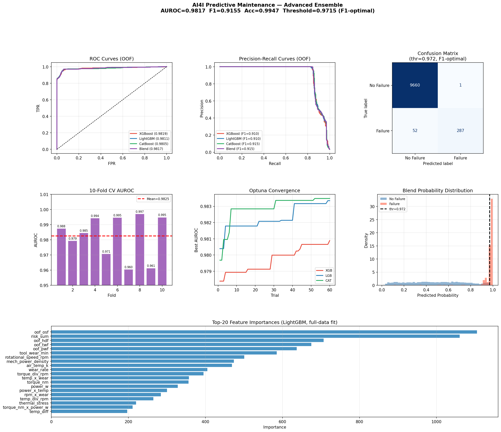

# AI4I Predictive Maintenance

## XGBoost + LightGBM + CatBoost Ensemble with Optuna

Predictive maintenance classification using the AI4I 2020 dataset. Employs a 3-model ensemble (XGBoost, LightGBM, CatBoost) with Optuna Bayesian hyperparameter optimization, stacking meta-learner, and advanced feature engineering including polynomial interactions and rank features.

---

## Results

| Metric | Score |
|--------|-------|
| ROC-AUC | **0.9817** |
| F1 Score | **0.9155** |
| Accuracy | **99.47%** |
| Precision | 0.9965 |
| Recall | 0.8466 |
| CV AUC (10-fold) | **0.9825 ± 0.013** |



---

## Architecture

```
XGBoost   (AUC 0.9819)  ─┐
LightGBM  (AUC 0.9811)  ──▶  Stacking Meta-Learner  ──▶  Final Prediction
CatBoost  (AUC 0.9805)  ─┘         (AUC 0.9820)
```

**Ensemble blend AUC:** 0.9817

---

## Features & Methodology

- **Feature Engineering:** 55 selected features from 59 engineered candidates, including polynomial interactions, rank features, and quantile-based transformations
- **Hyperparameter Optimization:** 60 Optuna Bayesian optimization trials per model
- **Cross-Validation:** 10-fold stratified CV
- **Threshold Selection:** F1-optimal threshold (0.9715)
- **Training Time:** ~174 seconds

---

## Dataset

**AI4I 2020 Predictive Maintenance Dataset**

A synthetic dataset reflecting real-world predictive maintenance scenarios with 10,000 data points and 14 features covering machine failures across 5 failure modes (Tool Wear Failure, Heat Dissipation Failure, Power Failure, Overstrain Failure, Random Failures).

---

## Kaggle Notebook

[ai4i-xgboost-predictive-maintenance](https://www.kaggle.com/code/akobirmusaev/ai4i-xgboost-predictive-maintenance)

---

## Files

| File | Description |
|------|-------------|
| `ai4i-xgboost-predictive-maintenance.ipynb` | Full training notebook |
| `metrics.json` | Saved model performance metrics |
| `training_results.png` | Performance visualization |
